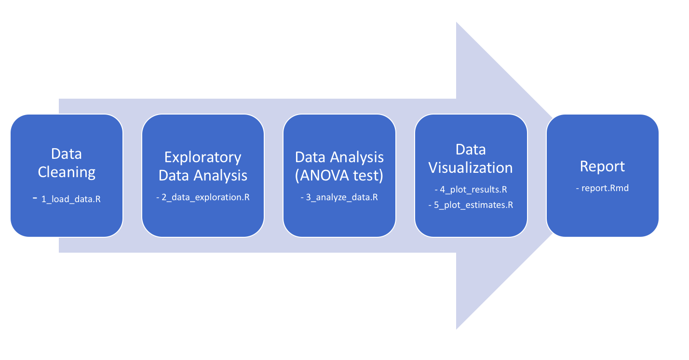

# Greenhouse Emission Comparisons

Contributers:
- [Miliban Keyim](https://github.com/mkeyim)
- [Chao Wang](https://github.com/chaomander2018)
- [Kera Yucel](https://github.com/K3ra-y)  

## Overview of contents

### Question: Is there an overall significant difference among the counties in their greenhouse gas emission?

This report contains an exploratory analysis regarding the Greenhouse Gas Emissions from 10 countries between 1990 and 2015. The data is obtained from the Greenhouse Gas Inventory Data of the United Nations Framework Convention Climate Change. The analysis aims to find if these are differences of greenhouse gas emissions (kt) across these countries. An ANOVA was performed to determine whether there is any significant difference in GHG emissions when observed, multiple comparisons on counties were performed.

Countries included into the analysis: Latvia, Switzerland, Portugal, Finland, Denmark, Czech Republic, Netherlands, Canada, Japan.

The final report consists:
- Hypothesis
- Statistical Summary of ANOVA
- Interpretation of Findings
- Critics, Limitations, and Assumptions on Analysis
- References

## Data

### Dataset
- This analysis is performed on [Greenhouse Gas (GHGs) Emissions, including Indirect CO2, without LULUCF, in kilotonne CO2 equivalent](http://data.un.org/Data.aspx?d=GHG&f=seriesID%3aGH2) provided by the United Nations Statistics Division databases.


### Data Attributes
- Country or Area: characters (set as `factor` for the analysis)
- Year: numeric
- Value: numeric


## The Analysis
We performed a set of [data exploration](https://besjournals.onlinelibrary.wiley.com/doi/full/10.1111/j.2041-210X.2009.00001.x) to identify initial problems in the dataset.

- In our initial exploratory analysis, we calculate estimates and variances for the 10 countries. We checked outliers and notice that European Union group is the outliers as its value is the aggregated value from multiple countries. We plotted a line graph to see the general trend of the 10 countries' Green House Gas emission within the time frame.

- Set up hypotheses and determine level of significance.  

  * H0: The expected mean greenhouse gas emission of all countries are equal.
  * H1: The expected mean greenhouse gas emission of all countries are not equal.

- *ANOVA* is used to decide whether there is a significant difference in the Greenhouse Gas Emission across the 10 countries. We used Tukey multiple pairwise-comparison to define which countries are significantly different than the other one.

- We prepare a table and a boxplot to show differences between counties and report F-value, p-value and means. Conclusion can be found in report.


## Procedure

This project contains five major steps including data cleaning, exploratory data analysis, ANOVA test, data visualization and final report.


## Usage
The usage of the make file are:
```
#'make all' simply tells the make tool to build the target 'all' in the makefile.
make all
# Delete all necessary files in case you need to run the analysis from scratch.
make clean
```

The report will be rendered into a PDF document.

## Dependencies

RStudio version 3.5.1  
[tidyverse](https://github.com/tidyverse)  
[readr](https://github.com/tidyverse/readr)  
[ggplot2](https://github.com/tidyverse/ggplot2)  
[dplyr](https://github.com/tidyverse/dpylr)  
[forcats](https://github.com/tidyverse/forcats)    
[broom](https://github.com/tidymodels/broom)  
[scales](https://github.com/r-lib/scales)  
[emmeans](https://github.com/rvlenth/emmeans)  
[multcompView](https://cran.r-project.org/web/packages/multcompView/index.html)  
[multcomp](https://cran.r-project.org/web/packages/multcomp/index.html)  


## Release version
 - [V1.0](https://github.com/UBC-MDS/DSCI_522_greenhouse_emissions_comparisons/releases/tag/v1.0) Proposal
 - [V2.1](https://github.com/UBC-MDS/DSCI_522_greenhouse_emissions_comparisons/releases/tag/V2.1) Milestone 1
