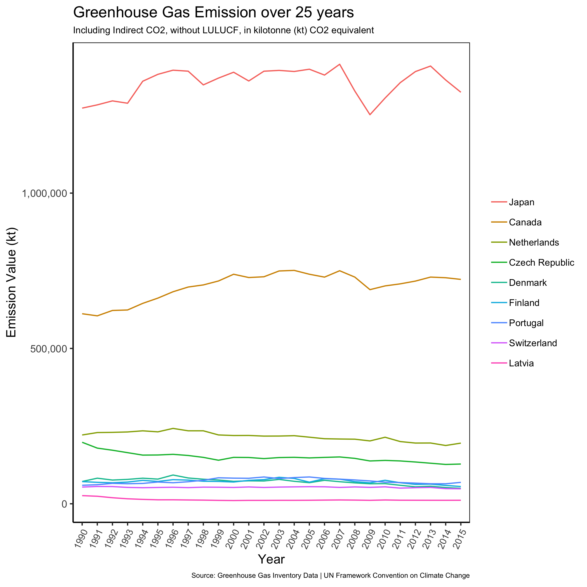
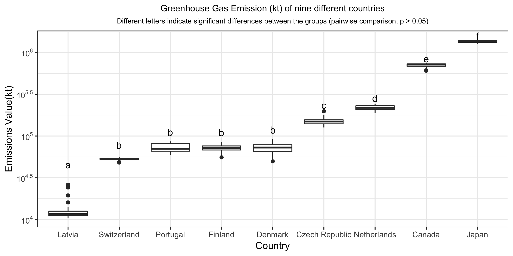

Greenhouse Gas Emission Comparisons with ANOVA
================
Miliban Keyim, Chao Wang and Kera Yucel
2018-12-01

This report contains an inferential analysis regarding the Greenhouse
Gas Emissions from 10 countries or regions between 1990 and 2015. The
analysis aims to find if there is a difference of greenhouse gas
emissions (kt) across these countries in the past 25 years. An ANOVA was
performed to determine whether there is any significant difference in
GHG Emissions when observed, multiple comparisons on counties were
performed. The
[data](%22http://data.un.org/Data.aspx?d=GHG&f=seriesID%3aGH2%22) is
obtained from the Greenhouse Gas Inventory Data of the United Nations
Framework Convention on Climate Change.

#### Our hypotheses are as follows:

*H*0: There is no difference between the amount of Greenhouse
Gas Emissions between the 10 nations from 1990 to 2015.

*H**A*: There is a difference between the amount of
Greenhouse Gas Emissions between the 10 nations from 1990 to 2015.

#### Analysis of National Emissions

25 years of collected data shows emissions for each of the nine nations,
these figures seem to display different patterns, with a group of
nations having very similar emission volumes (Figure 1). The aim of this
analysis is to find out whether there is a significant difference in
greenhouse gas emissions among all the nations. Prior to the analysis,
we performed exploratory data analysis (Zuur et al., 2010). Greenhouse
gas emission and countries were analyzed by a one-way ANOVA, the
significance level was set at *p* \< 0.05, and pairwise comparisons
between the multiple nations’ were evaluated.

Figure 1: Initial Exploratory analysis of the data shows there looks to
be a difference in emissions for some nations, but not all.

After running the initial exploratory analysis, it shows the European
Union has significantly higher values. Because we are unable to see
which countries were aggregated in the European Union category and their
individual values, we decided to remove the aggregate group titled
“European Union” and kept the individually labeled nations.

#### Statistical Summary of ANOVA:

Table 1: ANOVA test output

| term      | df  | sumsq       | meansq      | statistic | p.value |
| --------- | --- | ----------- | ----------- | --------- | ------- |
| Country   | 9   | 5.73925E+14 | 6.37695E+13 | 4536.75   | \<.001  |
| Residuals | 250 | 3.51405E+12 | 1.406E+10   |           |         |

The one-way ANOVA indicates that the greenhouse emission of the nine
nations are significantly different from each other (p-value \< 0.05).
Additionally, pairwise comparisons were conducted to determine which
nations are significantly different from each other.

Figure 2: Greenhouse Gas Emission (kt) of nine different countries in
the past 25 years. There is no significant difference between groups
with same letters and different letters indicate significant differences
between those countries (*p* \< 0.05).

#### Interpretation of Findings:

Latvia demonstrated the least GHG emissions of all the countries, as
research shows their government had established policies regarding
renewable energy that resulted in 29.6 % of energy consumptions in 2009
to be renewable (Roos et al., 2012). Canada and Japan displayed
significantly higher emission in the past 25 years. It is noted that
Canada’s greenhouse gas emission is originating from farming-related
activities and oil production which requires a large amount of
fossil-energy (Jarzen et al., 1998). Japan’s high emission is due to the
nation’s reliance on natural gas and coal to generate electricity
(Itawa, 2017).

### Critics, limitations, and assumptions on analysis:

1.  European Union data was removed as countries are not identified in
    the data and were aggregated, skewing the data presented.
2.  If compositions of the EU nations included in this data source, we
    would be able to split the EU emission into countries or further
    apply normalization to smooth out differences.
3.  In future analysis, we should try our best to keep all the original
    data in our analysis. We could do some sort of transformation to
    scale data to be on the same plane.
4.  Future analysis can shed light on GHG Emission over the years and
    which countries are statistically improving or not improving on the
    reduction of GHG Emission using time-series analysis.

## References

“Greenhouse Gas (GHGs) Emissions, including Indirect CO2, without
LULUCF, in kilotonne CO2 equivalent” Greenhouse Gas Inventory Data,
United Nations Framework Convention on Climate Change, website:
<http://data.un.org/Data.aspx?d=GHG&f=seriesID%3aGH2>

David Robinson, Alex Hayes, Matthieu Gomez, Boris Demeshev, Dieter
Menne, Benjamin Nutter, Luke Johnston, Ben Bolker, Francois Briatte,
Jeffrey Arnold, Jonah Gabry, Luciano Selzer, Gavin Simpson, Jens
Preussner, Jay Hesselberth, Hadley Wickham, Matthew Lincoln, Alessandro
Gasparini, Lukasz Komsta, Frederick Novometsky, Wilson Freitas, Michelle
Evans, Jason Cory Brunson, Simon Jackson, Ben Whalley, Michael Kuehn,
Jorge Cimentada, Erle Holgersen, Karl Dunkle Werner (2018).broom:
Summarizes key information about statistical objects in tidy tibbles.
This makes it easy to report results, create plots and consistently work
with large numbers of models at once. R package version 0.5.0
<https://cran.r-project.org/web/packages/broom/index.html>

Hadley Wickham (2017). tidyverse: Easily Install and Load the
‘Tidyverse’. R package version 1.2.1.
<https://CRAN.R-project.org/package=tidyverse>

Hadley Wickham (2018). forcats: Helpers for reordering factor levels
(including moving specified levels to front, ordering by first
appearance, reversing, and randomly shuffling), and tools for modifying
factor levels (including collapsing rare levels into other,
‘anonymising’, and manually ‘recoding’). R package version 0.3.0
<https://cran.r-project.org/packages=forcats>

Hadley Wickham, Jim Hester, Romain Francois, Jukka Jylänki, Mikkel
Jørgensen (2017). readr: The goal of ‘readr’ is to provide a fast and
friendly way to read rectangular data (like ‘csv’, ‘tsv’, and ‘fwf’). It
is designed to flexibly parse many types of data found in the wild,
while still cleanly failing when data unexpectedly changes. R package
version 1.1.1 <https://cran.r-project.org/web/packages/readr/>

Hadley Wickham, Romain François, Lionel Henry, Kirill
Müller(2018).dplyr: A fast, consistent tool for working with data frame
like objects, both in memory and out of memory. R package version 0.7.6.
<https://cran.r-project.org/web/packages/dplyr/>

Hadley Wickham, Winston Chang, Lionel Henry, Thomas Lin Pedersen, Kohske
Takahashi, Claus Wilke, Kara Woo (2018). ggplot2: A system for
‘declaratively’ creating graphics, based on “The Grammar of Graphics”.
You provide the data, tell ‘ggplot2’ how to map variables to aesthetics,
what graphical primitives to use, and it takes care of the details.R
package version 3.0.0.
<https://cran.r-project.org/web/packages/ggplot2/>

Hadley Wickham (2018) scales: Graphical scales map data to aesthetics,
and provide methods for automatically determining breaks and labels for
axes and legends.R package version 1.0.0.
<https://cran.r-project.org/web/packages/scales/>

Itawa, Mari (2017). The Wall Streeet Journal. “Japan CO2 Emissions Worst
on Record”.
<https://blogs.wsj.com/japanrealtime/2014/11/17/japan-co2-emissions-worst-on-record/>.

Janzen, H.H., 1999. Health of our air: Toward sustainable agriculture in
Canada (No. MIC-99-04464/XAB; SSC-A-53-1981/1998E). Agriculture and
Agri-Food Canada, Research Branch, Ottawa, Ontario (Canada).

Roos, I., Soosaar, S., Volkova, A. and Streimikene, D., 2012. Greenhouse
gas emission reduction perspectives in the Baltic States in frames of EU
energy and climate policy. Renewable and Sustainable Energy Reviews,
16(4), pp.2133-2146.

Zuur, A.F., Ieno, E.N. and Elphick, C.S., 2010. A protocol for data
exploration to avoid common statistical problems. Methods in ecology and
evolution, 1(1), pp.3-14.
